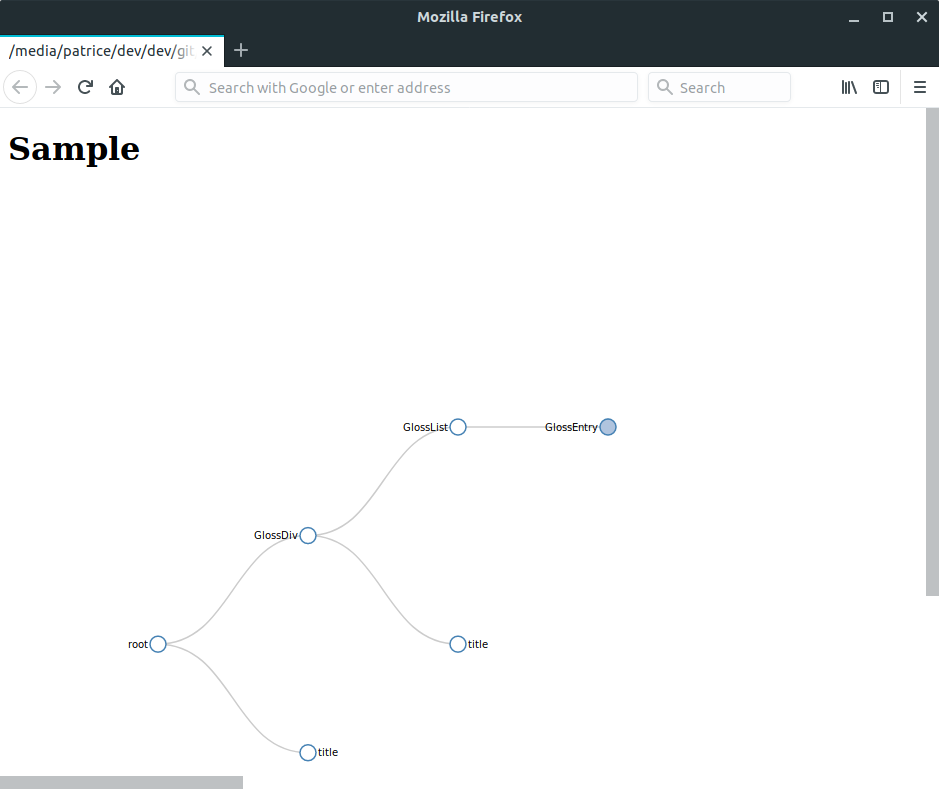

# jsonviewer

## A pretty way to present your json file
This script creates a tree and presents it in an a D3 HTML so you can drill down into it 
and view the first item and the last one at the same time 
plus, you can comment your nodes and subnodes 
### Example:
```
"GlossDiv": {
			"//comments":"this is a comment in a sub node",
```

### Execution command
```
jsonViewer -i sample.json -o out.html -t "Sample"  
```

## Installation
Download the project
change directory to jsonViewer
Install the package by typing 
```
pip install .
```

